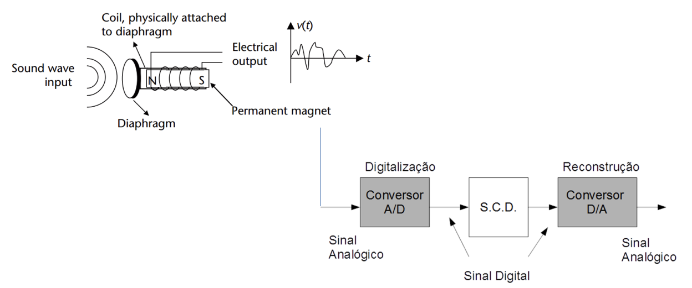

# Aula 2 - Sistemas de Comunicação Digital (SCD), Qualificadores e grandezas, Exemplos de aplicações de SCD

## Sistemas de Comunicação Digital

### Diagrama de blocos

### Conceitos base

- Sinal analógico: Tensão e corrente.
- Sinal digital: Sequência de bits.

- O **canal** pode ser com ou sem fios.
- **Sinal** é a informação que é transmitida.

**Diferentes maneiras de comunicar sequências binárias:**

**OOK**: _On-Off Keying_ (Caso particular de ASK - _Amplitude Shift Keying_)

**FSK**: _Frequency Shift Keying_
  * frequência para 1 é maior que a frequência de um bit 0

**PSK**: _Phase Shift Keying_
  * Inversão de fase na mudança de 0 para 1 e vice-versa
* Dado pelos 3 parâmetros da **sinosóide**:
    * Amplitude
    * Frequência
    * Fase

**QAM**: _Quadrature Amplitude Modulation_
  * Modulação de amplitude e fase
  * 4 bits códificados por sinal.

* **Qualificadores e grandezas:**
  * **Tb, tempo de bit [s]** - corresponde ao tempo que o sinal correspondente a cada bit está presente no canal. É o inverso da taxa de transmissão.
  * **Rb, ritmo binário ou débito binário [bit/s]** - é a taxa de bits por segundo que o SCD transfere
  * **BER - Bit Error Rate, taxa de erro de bit** - é o número de bits errados por bits transmitidos. É uma medida da qualidade da transmissão.
  * **Terr - tempo médio esperado entre erros consecutivos** - é definido por _Terr_= Tb/BER = 1/(Rb * BER)
  * **Tx - duração de transmissão de um conteúdo binário com #bits** - é definido por _Tx_ = #bits * Tb = #bits/Rb

* Deteção e Correção de Erros 
  * **CRC** - _Cyclic Redundancy Check_

### Exemplos de aplicações de SCD

