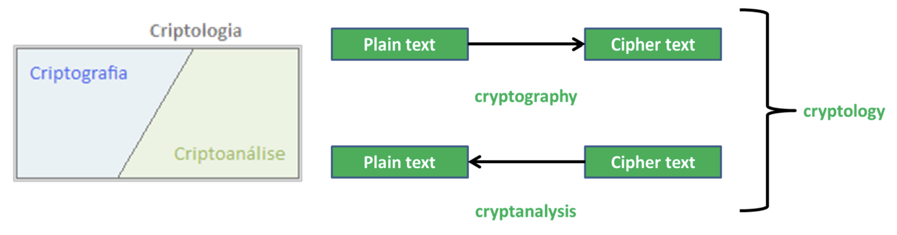

# Aula - Codificação de fonte baseada em dicionário (Tecnicas LZ)

## Teste 

4ª Feira, 19 Abil
18h30 - 20h00
Salas: A.2.12-13 A.2.16-18
Consulta: 1 Folha A4 (frente e verso)
Matéria: Até Slides #9

# Codificação

- é feita a conversão de dados antes do emissor, de forma a reduzir o tamanho do pacote a transmitir.
- Tecnicas estatisticas ou baseadas em dicionario

janela deslizante (dicionário e janela de codificação)

## Dicionário
### LZ77
- token: (posição, comprimento, caracter)
- 

### LZSS
- token: (.flag (position, length) ou .flag symbol)

## Estatística
### Huffman 
- Construção de árvore de Huffman conforme frequencia de simbolos

### Shannon-Fano
- Construção de árvore de Shannon-Fano conforme frequencia de simbolos

## Deflate

- algoritmo quando se une LZ e Huffman, para codificar dados

## Compressão
- Codificação sem perda (PNG, GIF, etc) -> lossless encoding
  - Conhecida como **compactação de dados**
  - os dados originais são iguais aos dados codificados

- Codificação com perda (JPEG, MP3, MP4, etc) -> lossy encoding
  - os dados originais não são iguais aos dados codificados
  - ocorre distorção

Codificador demora bastante mais tempo que o decodificador
do - dimensão original
dc - dimensão codificada

### Medidas de compressão

1) Razão de compressão ou taxa de compressão
   - dc/do * 100 [%]
2) Percentagem removida
   - (1-dc/do) * 100 [%]
3) Bit por byte
   - dc/do * 8 [bpb]
4) N:1
   - dc/do

## Sistemas Criptográficos

- Módulo de **cifra** (após a compressão dos dados)
- Módulo de **decifra** (antes da decompressão dos dados)

quintupleto (P,C,K,E,D)

- P: Plain Text - conjunto finito de possíveis textos em claro
- C: Cipher Text - conjunto finito de possíveis textos cifrados
- K: Key Space - conjunto finito de possíveis chaves
- E: Encipher - conjunto de regras de cifra
- D: Decipher - conjunto de regras de decifra

### Sistema One-Time Pad (OTP)

- a chave deve ser:
  - aleatória
  - deve ter pelo menos o mesmo tamanho do texto a cifrar
  - nunca deve ser reutilizada (totalmente ou parcialmente) 
  - Deve ser mantida secreta

A cifra é recíproca - a mesma chave pode ser usada para cifrar e decifrar

Quando os bits da chave são equiprováveis, a cifra é perfeita, ou seja, não é possível decifrar o texto cifrado.