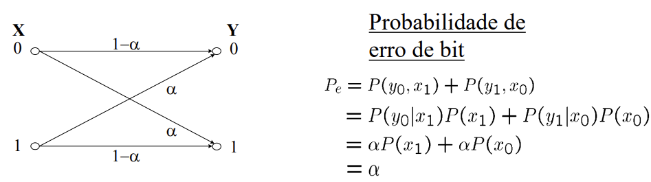
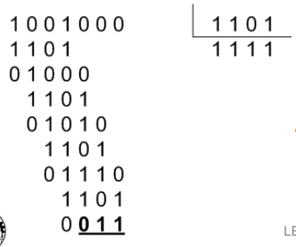
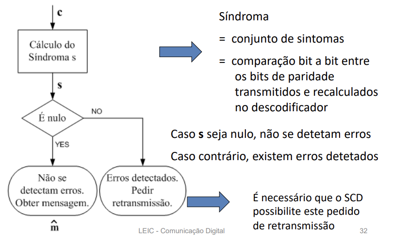
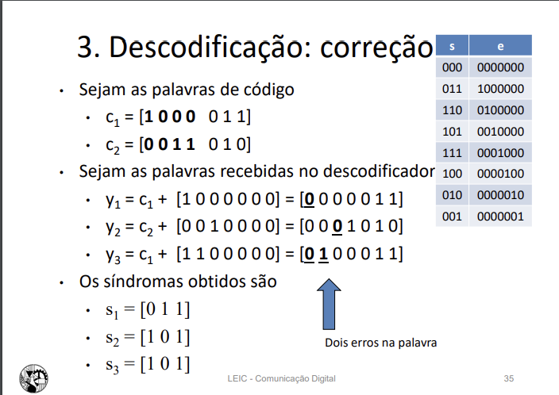

# Estudos T2

## Cap 10 - Codificação do Canal

duvida - foto

### Modos de funcionamento

**FEC** - Forward Error Correction
    - Modo de **correção** de erros
    - O recetor recebe as palavras, deteta eventuais erros e corrige-os
**ARQ** - Automatic Repeat Request (Retransmissão)
    - Modo de **deteção** de erros
    - O recetor recebe as palavras e deteta eventuais erros; em caso de erro, solicita a retransmissão

### Códigos de Bloco (n, k)

- Cada bloco de k bits de mensagem origina uma palavra de código com n bits
- **n** - número de bits da palavra de código
- **k** - número de bits de mensagem
- **q** - número de bits redundantes (n-k)
- code rate(ritmo)R = k/n, medida de eficiência
- Distância de **Hamming (dH)**: número de bits diferentes entre duas palavras de código
- **Distância mínima (dmin)**: menor distância de Hamming entre todas as palavras de código (dmin <= 1 + q, q = n-k)
- Deteta até dmin-1 erros
- Corrige até (dmin-1)/2 (arredondado para baixo) erros
- Deteta "l" erros e corrige "t" erros: dmin <= l+t+1, com l>t

### Códigos de Bloco Lineares

- Todas as palavras têm a mesma dimensão
- Linear:
  - O vetor nulo pertence ao código
  - A soma modular de quaisquer duas palavras do código é ainda uma palavra do código

**2^n** - palavras possíveis
**2^k** - palavras de código

- Os códigos lineares são um sub-conjunto de todos os códigos; requerem menos memória e existem codificadores e descodificadores simples.

### Código de repetição (3, 1)

- Consiste na repetição da mensagem
- Cada bit da mensagem é repetido 3 vezes

usa descodificação realizada por maioria

- Deteta todos os erros de 1 e 2 bit
- Corrige todos os erros de 1 bit

### Código de paridade (3, 2)

- Adicionar um bit no final da mensaagem; este bit é a soma módulo 2 dos bits da mensagem

a palavra de código é c = [m0 m1 m0 XOR m1]

- Deteta a presença de 1 e 3 bits errados
- Não tem capacidade de correção; não realiza FEC

### Peso de Hamming 

- Peso de Hamming (w) como o **número de dígitos não nulos numa palavra**
- Sejam ci e cj duas palavras distintas de um código linear de bloco; tem-se por definição que dmin = min w(ci XOR cj) = min w(ck), sendo ck uma palavra de código, diferente do vetor nulo

## Códigos de Hamming

Família de códigos lineares de bloco
Têm **dmin=3**, logo corrigem todos os erros de 1 bit
Defenidos por um parâmetro inteiro m (m>=2) tal que:

(n,k) = (2^m - 1, 2^m - 1 - m)

Equações de paridade Hamming (7,4):
b0 = m1 XOR m2 XOR m3
b1 = m0 XOR m1 XOR m3
b2 = m0 XOR m2 XOR m3

q >=3, sendo q=n-k o número de bits de paridade
n = 2^q - 1

## Códigos Cíclicos - CRC

- Linear - O vetor nulo pertence ao código; a soma modular de duas palavras é ainda uma palavra do código
- Bloco - todas as palavras têm a mesma dimensão de n bits

- Nos códigos cíclicos tem-se que qualquer rotação cíclica de qualquer ordem sobre uma palavra de código é ainda uma palavra de código
- c(X) = m(X) * g(X) em que:
- c(X) - palavra de código - polinómio de grau n-1
- m(X) - depende da mensagem - polinómio de grau k-1
- g(X) - polinómio gerador - polinómio de grau q

- determinado polinómio g(X) de grau q é gerador de um código (n,k), com q=n-k caso seja factor de X^n+1
- Ser fator de X^n+1 implica que o resto da divisão de X^n+1 por g(X) é **zero**
- através da fatorização de X^n+1, conseguimos obter polinómios geradores para códigos de diferentes dimensões

### CRC - Cyclic Redundancy Check

- num código cíclico sistemático, as palavras têm a seguinte organização:
- m(X) - mensagem
- m(X) + b(X) - palavra de código
- Os bits b(x) são os bits de redundância que se designam por **CRC**
- A palavra de código é dada por c(X) = m(X)X^q + b(X) = m(X)X^q + resto da divisão de m(X)X^q por g(X)
- m(X)X^q é a mensagem deslocada q bits para a esquerda
- CRC = b(X) = resto da divisão de m(X)X^q por g(X)

duvida - foto

## Descodificador de canal: características

O descodificador:
1. Rece a palavra y (possivelmente com erros)
2. estima a palavra de código x que lhe deu origem
3. estima a mensagem m 

x = argmin xi dH(y, xi), qualquer xi pertencente ao código

Este descodificador funciona num dos modos:
1. Deteção (ARQ)
   - Síndroma = comparação bit a bit entre os bits de paridade transmitidos e recalculados no descodificador.
   - caso seja nulo, não se detetam erros, caso contrário, existem erros detetados.

2. Correção (FEC)
  - Caso o síndroma detete erros (não seja nulo), obtem-se o padrão de erro através da consula à tabela de síndromas e padrões de erro e depois aplica-se a correção.

Tabela de síndromas para o código Hamming(7,4)

|Síndroma|Padrão de erro|Observações|
|--------|--------------|-----------|
|000|0000000|Sem erros|
|011|1000000|Erro no bit 1|
|110|0100000|Erro no bit 2|
|101|0010000|Erro no bit 3|
|111|0001000|Erro no bit 4|
|100|0000100|Erro no bit 5|
|010|0000010|Erro no bit 6|
|001|0000001|Erro no bit 7|

como foi feito o calculo do y3 que tem mais de 1 bit errado?

Duvida: CRC da pag 37 até à 41
Duvida: a cena das matrizes.

### Matriz Geradora

