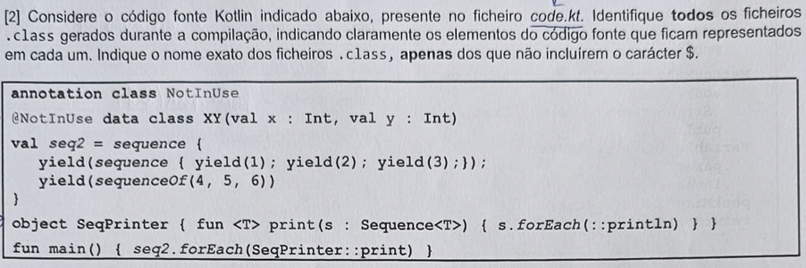
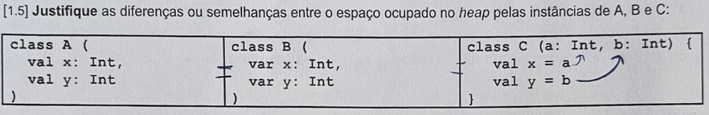
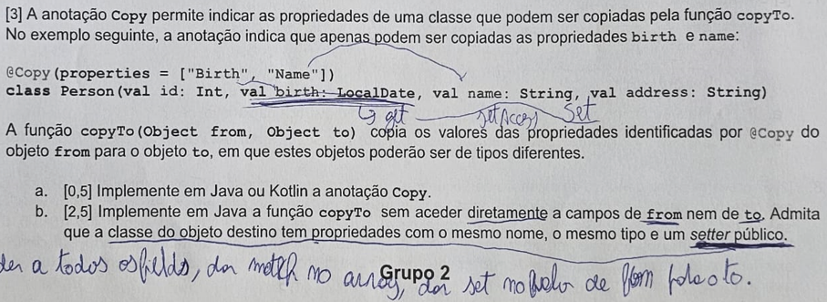
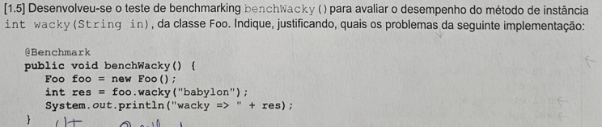
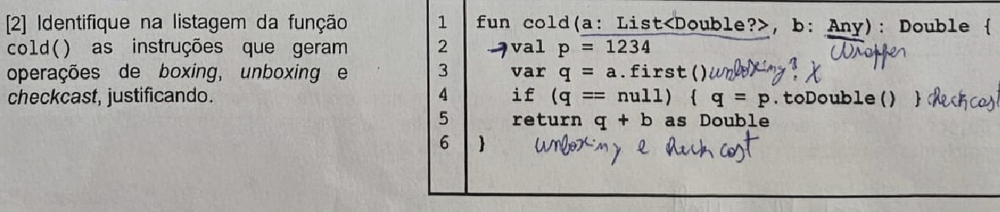
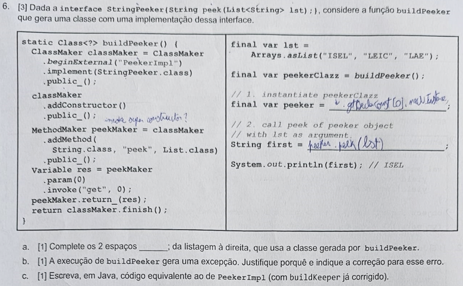

# O que está mal com o meu EN SV 22/23

## Ex 1



Faltou: **sequence {} também gera ficheiro .class, mas sequenceOf() não.**

## Ex 2



propriedade - getter e setter
campo - getter, setter e backing field

Faltou: **referir que por serem campos geravam backing field e que são do mesmo tipo**

## Ex 3



a) Faltou: @Target(ElementType.CLASS) e @Retention(RetentionPolicy.RUNTIME)

b) Não era para aceder diretamente a campos e sim ir pelos metodos getters e setters, e ainda, não podemos usar field.value sobre fields, deveria ser field.get(obj), com obj a ser o objeto que tem o field.

A resposta correta seria:

```java
TODO 
```

## Ex 4



Faltou: O facto de ter dito que Foo era uma classe, e é sim um objeto, depois não se resolveria o problema criando uma classe base e sim para todas (neste caso o Foo) as criações de instância (new), passar como parâmetro para não prejudicar o desempenho

## Ex 5



Resposta: 
Linha 3 tinha unboxing devido ao type erasure

Linha 5 - unboxing, seguido de check cast e depois outro unboxing.


fun cold(a: List<Double?>, b: Any) : Double {
    val p = 1234
    var q = a.first()
    if(q == null) { q = p.toDouble() }
    return q + b as Double
}

## Ex 6 



a)
no primeiro ponto faltou por o cast para PeekerImpl

b) 