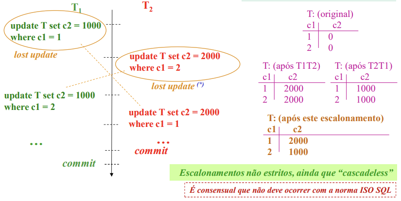
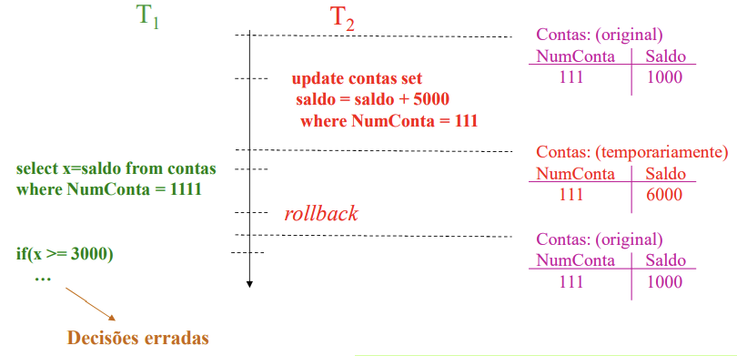
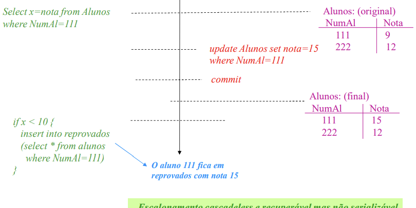
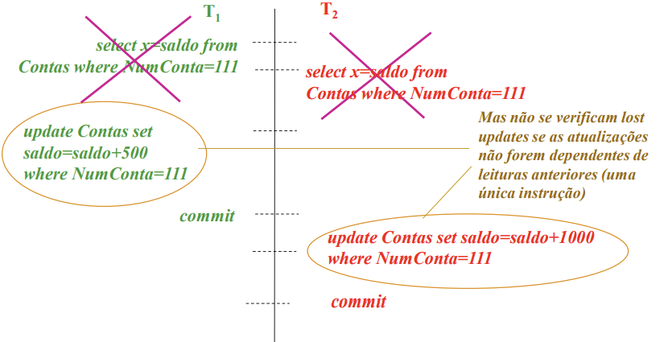
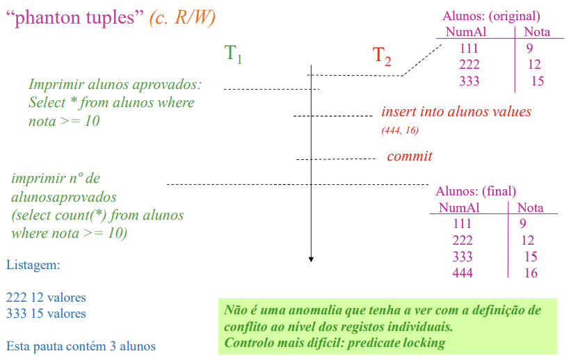
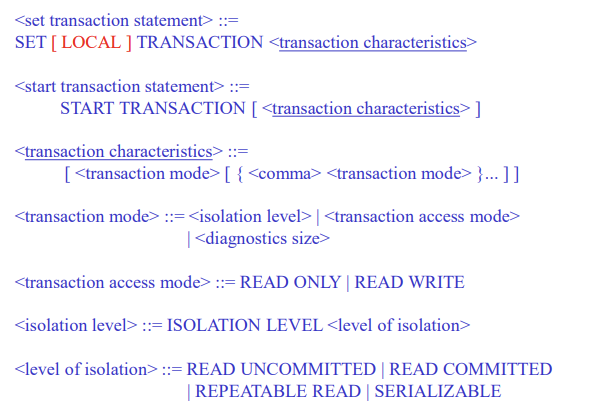
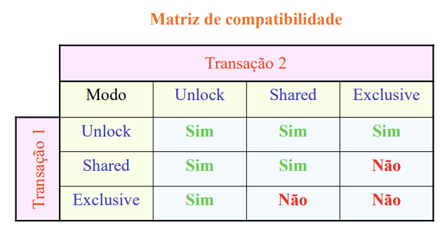

## Aula 4 - Anomalias

## Anomalias em transações e concorrência

#### **"overwriting uncommited data"** (conflito W/W) - AKA **Dirty Write**
  - O problema acontece quando escrevemos por cima de dados que não foram commitados, e que podem ser lidos por outra transação.
  - esta anomalia nunca ocorre com a norma ISO SQL,pois a norma coloca um **lock** no registo, e no seguinte exemplo, gera um **_dead lock_**.
  

#### **"uncommited dependency"** (conflito W/R) - AKA **Dirty Reads** 
  - As situações podem ser mais complexas
  - O problema acontece quando lemos valores que não foram commitados, e que podem ser escritos por outra transação.
  - pode ocorrer na norma ISO SQL se escolhermos o nivel de isolamento READ UNCOMMITED, pois permite tais leituras.
  - A partir do nivel READ COMMITED impede-se este tipo de anomalias.

#### **"nonrepeatable read" ou "inconsistent analysis"** (conflito R/W) - AKA **Fuzzy Reads**
  - O problema é que mesmo não fazendo **dirty reads**, não fazemos a repetição da leitura, e o valor pode ter mudado.
  - são **cascadeless**, mas não são serializáveis.
  - se formos nós a fazer o código, para evitar esta anomalia, nunca devemos fazer escritas com base em leituras feitas anteriormente, fazer tudo de uma vez, ou subir o nível de isolamento para REPEATABLE READ.
  - 

#### **phantom tuples** (c. R/W)
  - Não é uma anomalia que tenha a ver com a definição de conflitos ao nível dos registos individuais.
  - É possível resolver com predicate locking ou com SERIALIZABLE

### Estados

**Activa:** é o estado após início da transação e mantém-se enquanto se forem realizando operações de leitura e escrita.

**Parcialmente commited:** quando se indica que a transação vai ser commited, mas ainda não terminou de escrever todos os registos.

**Commited:** a transação entra neste estado quando atinge o commit point(escreve [commit, T] no log)

**Falhada:** a transação entra neste estado quando atinge o abort point(escreve [abort, T] no log)

**Terminada:** a transação deixa de existir no sistema

## Níveis de Isolamento

- Para definir o nível de isolamento, devemos utilizar a linguagem:
  - SET TRANSACTION ISOLATION LEVEL <nível de isolamento>;
  - START TRANSACTION ISOLATION LEVEL <nível de isolamento>;

## 2 phase locking

- assumir que não há prredicate locking devemos assumimos que existe lock à tabela toda
- porém com um arrange locking é possível restringir só partes da tabela com acesso a um indíce.
