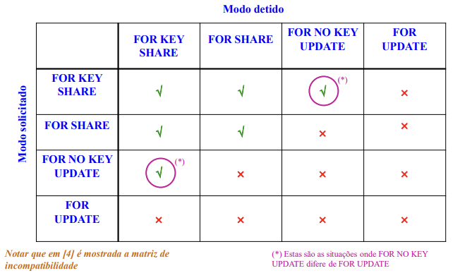
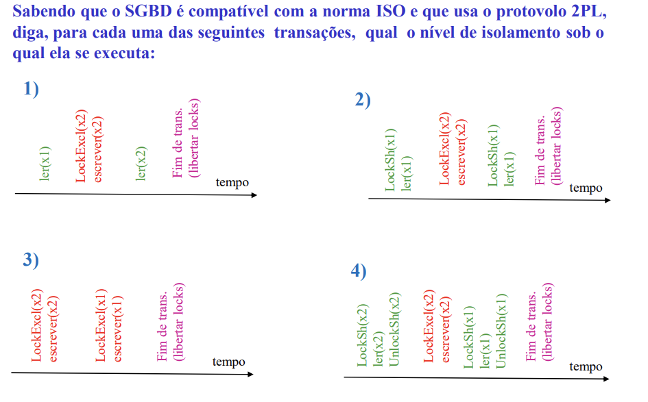

# Aula 7 - PGSql Continuação

## Locking

- É possível utilizar locking em PGSql tanto para leitura como para escrita.
  - select * from T where cs = 10 FOR SHARE (UPDATE (X) - )
- Só nos selects é que devemos definir o tipo de locking que queremos manualmente.
- Nas restantes instruções o PGSql faz o locking automaticamente.

## Exercícios

- Ex: 1

1) `read uncommited`
2) `repeatable read`
3) `Qualquer`
4) `read commited`

## TimeStamp

- Cada transação tem um timestamp associado.
- é possível utilizar o timestamp para fazer o locking.
- causa muitos Rollbacks

## Algoritmos de Multiversão

- Multiplas versões para escrita e leitura.
- 