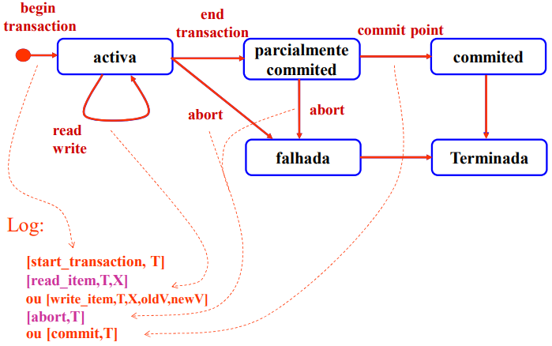

# Transações

## Porquê

- Recuperação
- Anular processamento anterior
- Controlar a interferência

### Tipos de Ações

- **Não protegidas:** aquelas cujos efeitos não necessitam de ser anulados. Por exemplo, uma operação sobre um ficheiro temporário
- **Protegidas:** aquelas cujos efeitos podem e devem ser anulados ou repostos se a transação falhar. Por exemplo, a escrita de um valor num registo. 
- **Reais:** aquelas ações cujo efeito é permanente e não pode ser anulado, por exemplo o lançamento de um míssil.

### Propriedades ACID

- **Atomicidade:** ou todas as operações são executadas com sucesso ou nenhuma é executada.
- **Consistência:** Uma transação deve deixar a base de dados num estado consistente.
- **Isolamento:** As transações concorrentes não devem interferir umas com as outras.
- **Durabilidade:** Uma transação que terminou com sucesso deve ser permanente.

### Escalonamentos

- **Cascadeless** - não tem dirty reads
- **Recuperável** - admite dirty reads, se a transação que fez o write terminar antes da outra.
  - Para o par de transações Ti e Tij, se Tj lê um valor escrito por Ti, então Ti termina antes de Tj.
- **Estrito** - se nenhuma das transações ler nem escrever um item escrito por outra transação ainda não terminada. 
  - Não admite dirty reads nem dirty writes.
- **série** - se todas as operações de todas as transações são executadas consecutivamente, sem intercalação.
  - Para N transações, existem N! escalonamentos em série.
- **Equivalentes do ponto de vista de conflito** - se a ordem de quaisquer duas operações conflituantes for a mesma nos dois escalonamentos.
- **Serializável** - se for equivalente a um escalonamento em série. (do ponto de vista de conflito)

### Grafos de Precedência

- **Grafo de Precedência** - grafo direcionado em que os nós são as transações e as arestas representam a dependência entre as transações.
  - Se existirem ciclos, o escalonamento não é serializável.

### Anomalias

- "overwriting uncommitted data" - **dirty write** (conflito W/W) 
  - Escalonamento não estrito, ainda que "cascadeless"
  - não deve ocorrer na norma ISO
- "reading uncommitted data" - **dirty read** (conflito W/R)
  - Escalonamento non-cascadeless
- "nonrepeatable read" - **fuzzy reads** (conflito R/W)
  - Escalonamento cascadeless e recuperável, mas não serializável
  - esta anomalia pode causar lost updates.
- "phantom tuples" - (conflito R/W)
  - existe controlo mais difícil, através de predicate locking

### Estados

- **Ativa** - é o estado após início da transação e mantém-se enquanto se forem realizando operações de leitura e escrita sobre dados.
- **Parcialmente commited** - quando se indica que a transação deve terminar com sucesso, entra-se neste estado. Nele é garantido que todos os dados são transferidos para disco e só se isso acontecer é que a transação atinge o commit point
- **Commited** - a transação entra neste estado quando atinge o commit point (escreve commit T no log)
- **Falhada** - a transação vem para este estado se for abortada no seu estado ativa ou se os testes realizados no estado parcialmente commited falharem. (escreve abort T no log)
- **Terminada** - a transação deixa de existir no sistema

### Níveis de isolamento

| Nível de isolamento | Dirty Write | Dirty Read | Fuzzy Read | Phantom Tuples 
| --- | --- | --- | --- | ---
| Read Uncommited | não | sim | sim | sim
| Read Commited | não | sim | sim | sim
| Repeatable Read | não | não | não | sim
| Serializable | não | não | não | não

- **Read Uncommited** - não é bem formada
- **Read Commited** - é bem formada.
- **Repeatable Read** - bem formada e de duas fases
- **Serializable** - bem formada, de duas fases e com predicate locking

- Repeatable Read - vai ler sempre o mesmo valor dos registos desde o começo da transação, mesmo que exista um novo estado commited estável.

## Protocolo 2PL

- Uma transação é sempre bem comportada relativamente às outras (write é bem formada e de duas fases), ou seja, não existe a anomalia de dirty write. o nível `read uncommited` só é possível com modo read-only.

- **read** - shared lokc
- **write** - exclusive lock

| Modo | Unlock | Shared | Exclusive
| --- | --- | --- | ---
| Unlock | SIM | SIM | SIM
| Shared | SIM | SIM | NÃO
| Exclusive | SIM | NÃO | NÃO

- **Ação bem formada:** - protegida por um par lock/unlock
- **Ações de duas fases:** - o lock é obtido antes da ação e o unlock é feito depois da ação

- **Wait-for-graph** - desenha-se um arco de Ti para Tj se Ti está à espera de Tj para obter um lock. Se existir um ciclo, existe um **deadlock**.

### Como lidar com deadlocks

- **Pessimista** - Não se permite o início de uma transação até que se garanta que ela consegue adquirir todos os locks de que necessita (pouco razoável na prática)
- **Otimista** - Permite que as transações se iniciem sem restrições, mas quando existir um deadlock abortar uma ou mais das transações envolvidas no deadlock.

## 2PL PostgreSQL

como usa `Snapshot`, nunca há dirty reads e por omissão as leituras não colocam locks.

- **Exclusive locks**: 
  - `FOR UPDATE` (o mais próximo do exclusive lock)
    - São colocados pelas instruções:
      - SELECT FOR UPDATE
      - DELETE
      - UPDATE de colunas que pertençam a uma restrição primary key ou unique que possa ser usadas numa chave estrangeira
  - `FOR NO KEY UPDATE `
    - São colocados pelas instruções:
      - SELECT FOR NO KEY UPDATE
      - UPDATE que não usem um lock FOR UPDATE

- **Shared locks**: 
  - `FOR SHARE` (o mais próximo do shared lock)
    - São colocados pelas instruções:
      - SELECT FOR SHARE
  - `FOR KEY SHARE `
    - São colocados pelas instruções:
      - SELECT FOR KEY SHARE

| | FOR KEY SHARE | FOR SHARE | FOR NO KEY UPDATE | FOR UPDATE
| --- | --- | --- | --- | ---
| FOR KEY SHARE | SIM | SIM | SIM | NÃO
| FOR SHARE | SIM | SIM | NÃO | NÃO
| FOR NO KEY UPDATE | SIM | NÃO | NÃO | NÃO
| FOR UPDATE | NÃO | NÃO | NÃO | NÃO